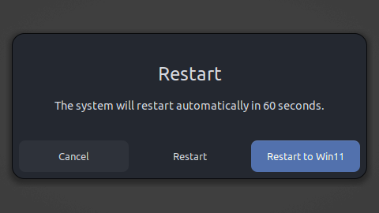

# Restart Into Windows - GNOME Shell Extension

A simple GNOME Shell extension that adds a "Restart to Windows" button to the restart dialog, making dual-boot switching effortless.



## Features

- 🚀 **One-click restart to Windows** - No more BIOS/GRUB menu navigation
- ⚡ **Fast and lightweight** - Minimal impact on system performance  
- 🔧 **Easy configuration** - Simple preferences interface
- 🔍 **Boot entry detection** - Automatically scan for OS installations
- 🐛 **Debug logging** - Optional logging for troubleshooting
- 🎨 **Customizable button text** - Personalize the button label
- 🔒 **Secure** - Uses standard Linux tools (efibootmgr)

## Requirements

- **GNOME Shell** 40+ (works on all modern versions)
- **UEFI system** with dual-boot setup
- **efibootmgr** package installed
- **Passwordless sudo** for restart commands (configured by installer)

## Common Issues:
- Sometimes, Windows Fastboot might cause problems with this, it is adviced to turn it off. Problems like wifi card not detected temporarily after booting ubuntu again were detected during testing.

## Installation

### Automatic Installation (Recommended)

1. **Download the extension**:
   ```bash
   git clone https://github.com/ishaan-dandekar/restartinto.git
   cd restartinto
   ```

2. **Run the installer**:
   ```bash
   chmod +x install.sh
   ./install.sh
   ```

3. **Follow the prompts**:
   - The script will set up passwordless sudo
   - Scan for Windows boot entries
   - Install and enable the extension

4. **Restart GNOME Shell** (if needed):
   - Press `Alt+F2`, type `r`, press Enter (X11 only)
   - Or log out and back in

### Manual Installation

1. **Install dependencies**:
   ```bash
   # Ubuntu/Debian
   sudo apt install efibootmgr libglib2.0-dev
   
   # Fedora
   sudo dnf install efibootmgr glib2-devel
   
   # Arch Linux
   sudo pacman -S efibootmgr glib2
   ```

2. **Create extension directory**:
   ```bash
   mkdir -p ~/.local/share/gnome-shell/extensions/restartinto@ishaan-dandekar.github.io
   ```

3. **Copy files** and **compile schema**:
   ```bash
   cp -r * ~/.local/share/gnome-shell/extensions/restartinto@ishaan-dandekar.github.io/
   glib-compile-schemas ~/.local/share/gnome-shell/extensions/restartinto@ishaan-dandekar.github.io/schemas/
   ```

4. **Enable extension**:
   ```bash
   gnome-extensions enable restartinto@ishaan-dandekar.github.io
   ```

## Configuration

### Find Your preferred OS Boot ID

Run this command to see all boot entries:
```bash
sudo efibootmgr
```

Look for entries like:
- `Boot0000* Windows Boot Manager`
- `Boot0001* Microsoft Windows`

The 4-digit number (e.g., `0000`) is your boot ID.

### Configure the Extension

1. **Open preferences**:
   ```bash
   gnome-extensions prefs restartinto@ishaan-dandekar.github.io
   ```

2. **Set your Windows boot ID** (e.g., `0000`)

3. **Customize button text** (optional)

4. **Use the boot scanner** to find Windows entries automatically

## Usage

1. **Open restart dialog**:
   - Activities → Power Off/Log Out → Restart

2. **Click "Restart to Windows"** button

3. **System restarts directly into Windows** 🎉

## Troubleshooting

### Extension not appearing
- Restart GNOME Shell: `Alt+F2` → type `r` → Enter
- Check if enabled: `gnome-extensions list --enabled`
- Re-enable: `gnome-extensions enable restartinto@ishaan-dandekar.github.io`

### Permission errors
- Ensure sudoers rule exists: `sudo cat /etc/sudoers.d/restartinto`
- Re-run installer to fix permissions

### Wrong Windows version boots
- Use the boot scanner in preferences to find correct boot ID
- Update boot ID in preferences
- Test with: `sudo efibootmgr -n XXXX && echo "Boot ID XXXX set"`

### Debug logging
- Enable debug mode in preferences
- Check logs: `journalctl -f -o cat /usr/bin/gnome-shell`

## Uninstallation

```bash
# Disable extension
gnome-extensions disable restartinto@ishaan-dandekar.github.io

# Remove files
rm -rf ~/.local/share/gnome-shell/extensions/restartinto@ishaan-dandekar.github.io

# Remove sudoers rule (optional)
sudo rm /etc/sudoers.d/restartinto
```

## Technical Details

- **Extension ID**: `restartinto@ishaan-dandekar.github.io`
- **Command executed**: `efibootmgr -n XXXX && reboot`
- **Settings schema**: `org.gnome.shell.extensions.restartinto`
- **Compatible**: GNOME Shell 40, 41, 42, 43, 44, 45, 46+

## Contributing

Contributions are welcome! Please feel free to:

- 🐛 Report bugs
- 💡 Suggest features  
- 🔧 Submit pull requests
- 📖 Improve documentation

## License

This project is licensed under the **GPL-3.0 License** - see the [LICENSE](LICENSE) file for details.

## Author

**Ishaan Dandekar**
- GitHub: [@ishaan-dandekar](https://github.com/ishaan-dandekar)

## Acknowledgments

- GNOME Shell development team
- Linux dual-boot community
- Contributors and testers

---

⭐ **Found this helpful?** Give it a star on GitHub!

🐛 **Issues?** Report them in the [Issues section](https://github.com/ishaan-dandekar/restartinto/issues)

💬 **Questions?** Start a [Discussion](https://github.com/ishaan-dandekar/restartinto/discussions)
